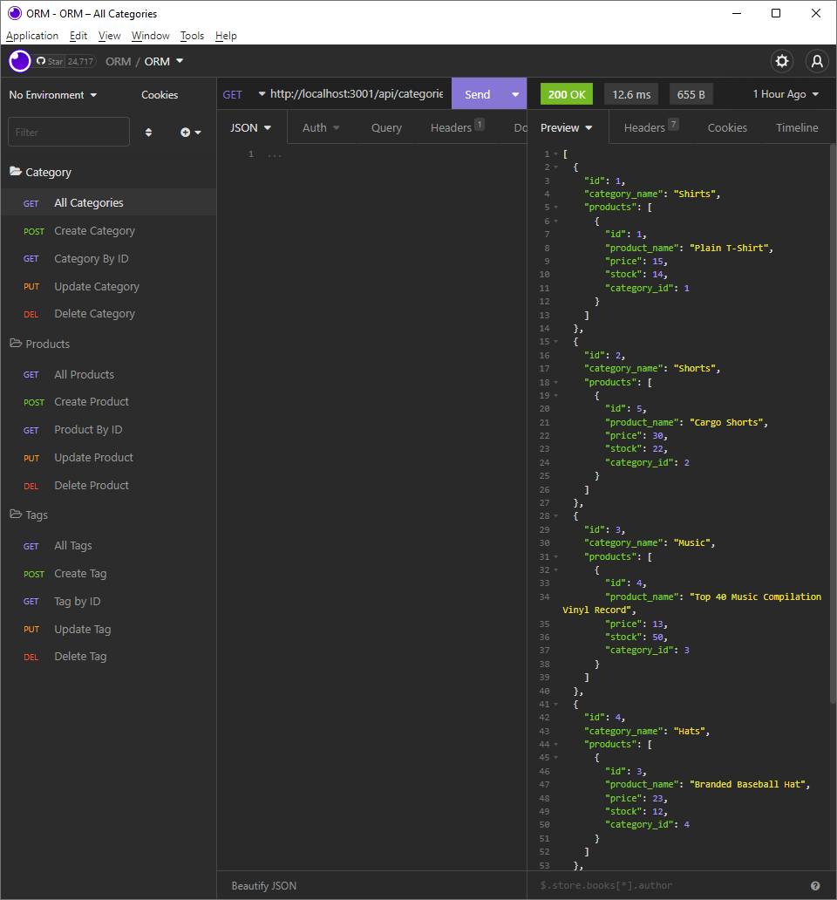

# ORM

## Description
This app serves as the back end for an e-commerce site. Using Express.js API, Sequelize, and MySQL database, it has configured the database to run queries on each model: Category, Product and API, and to update or delete those categories, products, or tags.

## Technologies Used
- Sequelize
- Express
- MySQL
- JSON
- Insomnia
- JavaScript

## Screenshot

## Links
- Video https://drive.google.com/file/d/1iORHtf4xjQp7EeB8uKpr2YfibV7Oxxp0/view 
- Repo https://github.com/RKH1988/ORM
